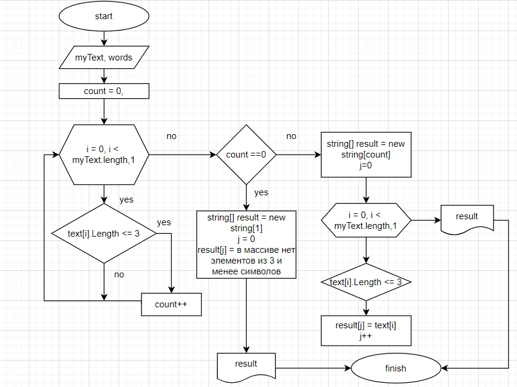

# Итоговый проект. Выбор специализации.

*Задача: Написать программу, из имеющего массива строк
формирует массив из строк, длина которых меньше либо 
равна 3 символам. Первоначальный массив можно ввести
с клавиатуры, либо задать на старте выполнения алгоритма.
При решении не рекомендуется пользоваться
коллекциями, лучше исключительно обойтись массивами.*

## Блок-схема

